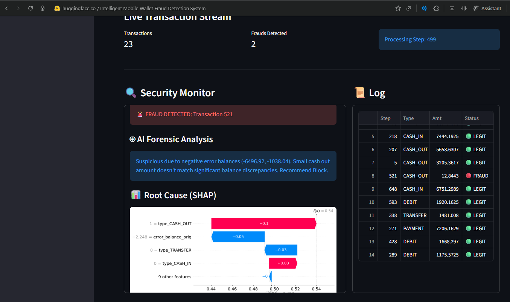

# Intelligent Mobile Wallet Fraud Detection System
## Real-time Detection & Generative AI Forensics



### Executive Summary
This project represents a next-generation approach to financial security. Unlike traditional systems that simply flag transactions as "suspicious" or "safe" without context, this system integrates two powerful technologies:
1.  **Machine Learning** to detect complex fraud patterns in real-time with high precision.
2.  **Generative AI (Forensic Agent)** to instantly analyze the flagged transaction and generate a natural language report explaining *why* it is suspicious.

### Why This Project Stands Out
*   **Transparency:** Most fraud models are "black boxes." This system explains its reasoning in plain English, bridging the gap between complex algorithms and human decision-makers.
*   **Speed:** It processes transactions instantly as they occur, allowing for immediate intervention before funds are lost.
*   **Precision:** By identifying deterministic patterns in financial behavior (such as the exact zeroing-out of accounts), the system achieves exceptional accuracy (verified via AUPRC on imbalanced data), minimizing false alarms that frustrate legitimate customers.

### How It Works (Simplified)
Imagine a digital security guard that never sleeps.
1.  **The Watchdog:** As money moves between accounts, the Machine Learning model observes the transaction details (amount, balances, timing). It compares this against millions of past examples to spot anomalies.
2.  **The Detective:** When the Watchdog spots a thief, it calls the Detective (the Generative AI). The Detective looks at the specific evidence and writes a brief report, such as: "This looks like an account takeover because the entire balance was transferred to a new account immediately after a login."

### Technical Architecture
*   **Core Engine:** Random Forest Classifier (Supervised Machine Learning)
*   **Forensics Layer:** Hugging Face Inference API (Generative AI) & SHAP (Explainable AI)
*   **Interface:** Streamlit (Real-time Interactive Dashboard)
*   **Data Source:** PaySim Mobile Money Dataset

### Industry-Grade Enhancements (v2.0)
To meet production standards, the system has been upgraded with:
*   **Robust Pipelines:** Replaced fragile encoding with `OneHotEncoder` and `StandardScaler` inside a persistent stateful pipeline, ensuring consistency between training and live inference.
*   **Realistic Evaluation:** Shifted from balanced accuracy to **AUPRC (Area Under Precision-Recall Curve)** on imbalanced test sets (1:1000 ratio) to reflect real-world performance where fraud is rare.
*   **Explainable AI (XAI):** Integrated **SHAP (SHapley Additive exPlanations)** values to visualize exactly which features drove the model's decision, alongside the LLM's narrative analysis.
*   **Automated Testing:** Added schema validation and pipeline unit tests to prevent data drift and integration errors.

### Installation & Usage

1.  **Install Requirements**
    ```bash
    pip install -r requirements.txt
    ```

2.  **Configuration**
    Create a file named `.env` and add your Hugging Face Token:
    ```
    HF_TOKEN=your_token_here
    ```

3.  **Run the Dashboard**
    ```bash
    streamlit run src/dashboard.py
    ```

4.  **Operation**
    *   Click **"Train Model"** to teach the system using the provided dataset.
    *   Click **"Start Live Simulation"** to watch the system protect transactions in real-time.